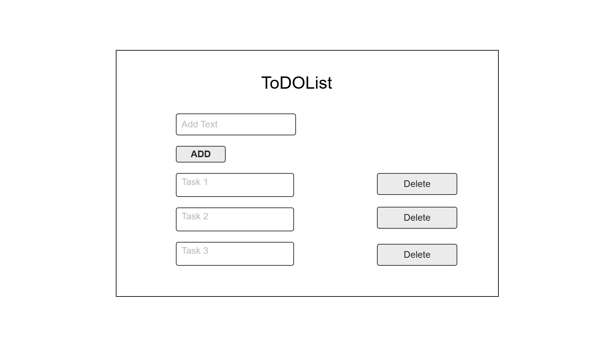

# Web Dev Starter Code

## Project Spec

The project I’m building is a web-based TODO List application, designed with simplicity and usability in mind. This project is something I not only want to create for this assignment but also hope to use personally in the future for day-to-day organization. The main idea is to help users manage tasks by providing them with a digital space where they can quickly and easily add, view, and delete items from a list. Whether it's keeping track of a grocery list, managing chores, planning out homework assignments, or organizing daily goals, this app will serve as a practical tool for managing all kinds of tasks.

The core functionality will include the ability to add new tasks to a list, delete tasks once they’ve been completed, and retrieve tasks from the backend using AWS services. The tasks will be stored in a database so that the user can access their list across multiple sessions or devices. At its heart, the project is about creating a reliable and user-friendly way to track things that need to get done — whether those are errands, reminders, or goals.

The primary audience for this app is anyone who needs to organize their time or tasks. While the title "TODO List" suggests it’s focused on productivity-related tasks, the app will be flexible enough to be used for all types of lists. This means users can get creative — using it for shopping lists, movies to watch, books to read, or even packing lists for a trip. The purpose of the app is to give people a centralized place to manage whatever they want to keep track of. There are no limitations on how it’s used, which adds to its usefulness and appeal.

One important design goal is to keep the interface minimal, clean, and accessible. I want the app to be easy to use, even for people who may not be very tech-savvy. The features will be straightforward so users don’t feel overwhelmed. Tasks will be displayed clearly, and users can simply click a button to add or remove items. In addition, I plan to style each page using custom CSS to give the app a polished, modern look while meeting accessibility standards for better usability.

While the initial version will focus on essential functionality, I’d like to continue expanding it in the future. One of the features I’d really like to add is the ability to attach images to tasks. This could be useful for things like recipe lists, where an image of a dish could accompany the ingredients, or for visual reminders when words aren’t enough. I also want to look into implementing filters, priority levels, or even due dates as future upgrades.

Overall, this project is something I hope will be genuinely helpful to others (and to myself). By combining clean design, essential task management tools, and the potential for more advanced features, I believe this TODO List app will be a valuable and practical solution for everyday organization.

## Project Wireframe

TODO: Replace the wireframe below with you own design.

